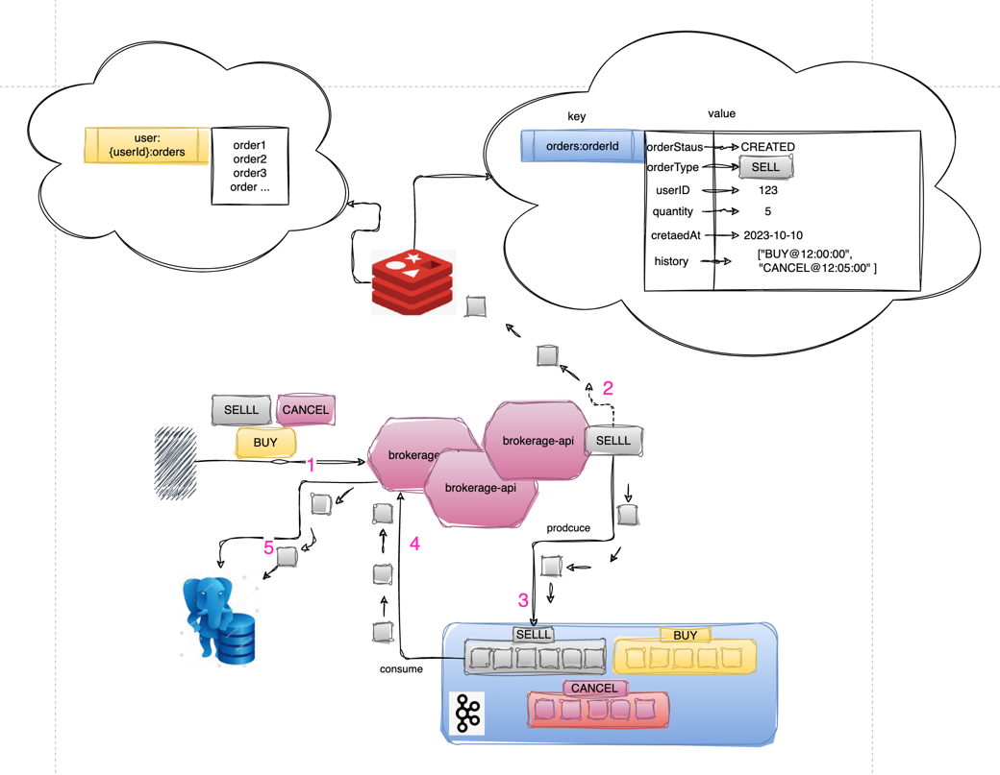

# Brokerage Provider API

## Overview
This project simulates a brokerage provider where users can manage (buy, sell, cancel, retrieve) any order for APPLE stocks. The system is designed to handle only 10 APPLE stocks.

## Technical Stack
- **Language**: Java 17
- **Framework**: Spring Boot 3.1.3
- **Database**: PostgreSQL
- **Cache**: Redis
- **Message Broker**: Kafka

## Getting Started

### Prerequisites
- Docker and Docker Compose installed on your machine.

### Running the Application

1. **Build the Docker Image for the Spring Boot Application**:
   Navigate to the root directory of the project and run:
   ```bash
    docker build -t brokerage-api:latest .


2. **Start the Services**:
   In the same directory, run:
   ```bash
    docker-compose up

This command will start the PostgreSQL, Kafka, Redis, and the Spring Boot application. The application will be accessible at `http://localhost:8080`.

3. **Stopping the Services**:
   To stop the services and remove the containers, run:
   ```bash
   docker-compose down

You can test the API using [Swagger UI](http://localhost:8080/swagger-ui/index.html).

### Instructions and Example Requests

The system has a predefined stock ticker identified as "APPL" and a predefined user with a userId of 1. Please consider these predefined values when preparing your requests. Below are example requests for different operations:

#### BUY Request:
```sh
curl -X 'POST' \
  'http://localhost:8080/trades/buy' \
  -H 'accept: */*' \
  -H 'Content-Type: application/json' \
  -d '{
  "userId": 1,
  "ticker": "APPL",
  "quantity": 1
}'
```

#### SELL Request:
```sh
curl -X 'POST' \
  'http://localhost:8080/trades/sell' \
  -H 'accept: */*' \
  -H 'Content-Type: application/json' \
  -d '{
  "userId": 1,
  "ticker": "APPL",
  "quantity": 1
}'
```

#### CANCEL Request:
```sh
curl -X 'POST' \
  'http://localhost:8080/trades/cancel' \
  -H 'accept: */*' \
  -H 'Content-Type: application/json' \
  -d '{
  "userId": 1,
  "ticker": "APPL",
  "orderId": "8a6ce4bd-f3e1-4090-bc01-07c178355f53"
}'
```


## Design
Requests for buy, sell, and cancel operations are first logged and then cached in Redis. These requests are then sent to Kafka. The same service consumes these messages from Kafka and processes them. Before processing, the service checks the Redis cache for stock availability and uses distributed locks to ensure data integrity. Once the transaction is processed, the cache in Redis is updated, and the transaction record is stored in the PostgreSQL database. During this process, the transaction status (success/failure) is sent to a Kafka topic to notify the user.



#### Summary of the Process:
- **User Interaction**: The user initiates a BUY/SELL order which is first cached in Redis. If an OrderID already exists in Redis, the CurrentStatus and History are updated; otherwise, a new hash structure is created for the new OrderID.

- **Order Processing**: The order is then sent to Kafka. A Consumer Service consumes the order from Kafka, performs the necessary checks, processes the order, and saves the logs in the Database.

- **Data Update**: After processing the order and saving the logs, the Consumer Service updates the hash structure in Redis Cache.

- **User Query**: The user can query the last transactions, and Redis returns the last 10 transactions and their details to the user.


[You can view this diagram in a new tab.](https://showme.redstarplugin.com/d/d:tl2KCNb5)


## Implementation Details

- **Reactive Programming**: Reactive programming was utilized for the buy and sell order operations due to their potentially high frequency. However, for user creation, retrieval, and processing of events consumed from Kafka, reactive programming was not implemented as the operations are handled sequentially and do not block each other, eliminating the need for a non-blocking programming model in these cases

- **Database Choice**: PostgreSQL was chosen as the primary database for this project due to its ACID compliance, ensuring high reliability and data integrity, which are crucial for financial transactions and stock trading applications. While MongoDB, with its extensive support for reactive operations and flexibility in handling different data types, could be considered more suitable for development speed and scalability, the stringent data integrity rules of relational database management systems like PostgreSQL make it a preferred choice for handling critical operations such as financial transactions.

- **Order Processing**: Buy and sell order operations are handled in separate Kafka topics with a single partition. This design choice was made to maintain the order of operations and prevent race conditions. Data consistency for different operations is ensured using distributed locking.

- **Order Status**: The system maintains four statuses for orders: CREATED, COMPLETED, CANCELLED, and FAILED.

- **Cancellation Mechanism**: The cancellation mechanism is facilitated through the caching system. When a BUY or SELL order is initiated, it is first cached. If a CANCEL order is received subsequently for the same OrderID, this cancellation is recorded in the history of that OrderID in the cache. The Consumer Service, which listens to the events from Kafka, checks the cache before processing BUY and SELL orders. If the history indicates that the order has been cancelled, the Consumer Service does not proceed with the transaction and cancels it; otherwise, it continues with the normal workflow.

## Endpoints
1. Create User
2. Retrieve User
3. Buy Order
4. Sell Order
5. Cancel Order
6. Retrieve Specific Order
7. Retrieve USer Orders
8. Stream Order Events

## Notes
- The project has been dockerized and is available in a private Github repository.
- Distributed locks are used to ensure data consistency.
- The system is designed as a single service for simplicity.
- Comprehensive unit tests have not been written; however, integration tests have been implemented using TestContainers.
- Security implementations are not included in the current version of the project.
- Attention is needed to ensure that the ports required by the application are available when starting up the application.


